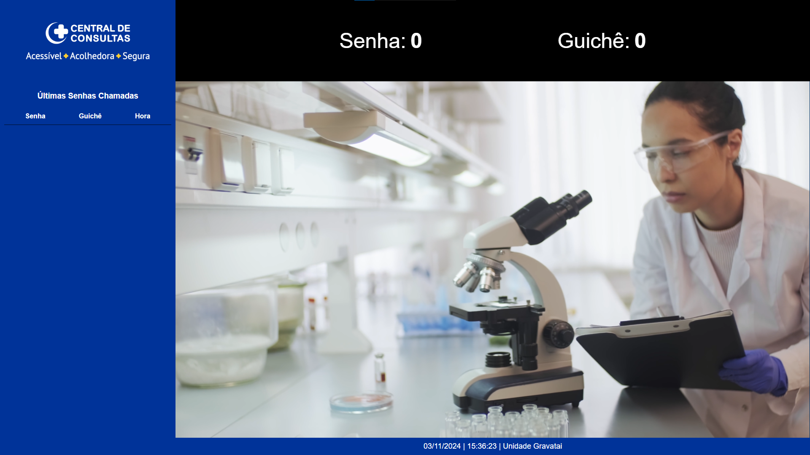
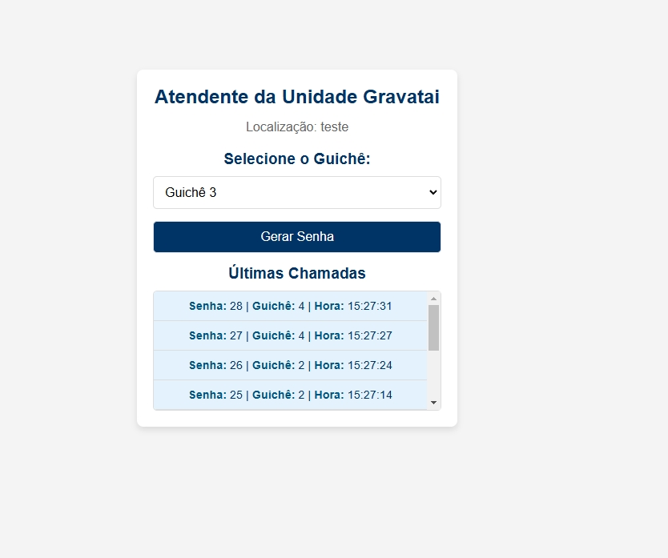

# Painel de Senhas com Flask e Docker

Este projeto é uma aplicação desenvolvida em Flask para gerenciar senhas em uma clínica, utilizando Flask, Socket.IO e PostgreSQL. O sistema permite a administração de clínicas, atendentes e um painel responsivo para exibição de senhas.

## **Índice**
- [Pré-requisitos](#pré-requisitos)
- [Como Rodar o Projeto](#como-rodar-o-projeto)
  - [Clonar o Repositório](#1-clonar-o-repositório)
  - [Configurar Variáveis de Ambiente](#2-configurar-variáveis-de-ambiente)
  - [Construir e Iniciar o Projeto com Docker](#3-construir-e-iniciar-o-projeto-com-docker)
- [Rotas Principais](#rotas-principais)
- [Atualizações Futuras (Push)](#atualizações-futuras-push)
- [Interface do Painel](#interface-do-painel)

---

## **Pré-requisitos**

Antes de iniciar, certifique-se de que os seguintes softwares estejam instalados em sua máquina:

- [Docker](https://www.docker.com/)
- [Docker Compose](https://docs.docker.com/compose/)

---

## **Como Rodar o Projeto**

Siga os passos abaixo para executar o projeto em um ambiente Docker.

### **1. Clonar o Repositório**

Clone o repositório para sua máquina local e navegue até o diretório do projeto:

```bash
git clone https://github.com/SEU_USUARIO/SEU_REPOSITORIO.git
cd SEU_REPOSITORIO
```

### **2. Configurar Variáveis de Ambiente**

Crie um arquivo `.env` na raiz do projeto e configure as seguintes variáveis de ambiente:

```env
# .env
POSTGRES_DB=painel_senhas_db
POSTGRES_USER=admin
POSTGRES_PASSWORD=admin123
POSTGRES_HOST=db
POSTGRES_PORT=5432
```

### **3. Construir e Iniciar o Projeto com Docker**

No diretório raiz do projeto, execute o comando abaixo para construir e iniciar os contêineres:

```bash
docker-compose up --build
```

A aplicação ficará disponível em `http://localhost:5000/`.

---

## **Rotas Principais**

Com base na estrutura do projeto, as seguintes rotas estão configuradas:

### **1. Página Principal (Atendente)**
- **URL:** `http://localhost:5000/`
- **Descrição:** Página inicial onde o atendente interage com o sistema.

### **2. Painel de Senhas (por clínica)**
- **URL:** `http://localhost:5000/clinica/<clinic_id>/panel`
  - Exemplo: `http://localhost:5000/clinica/1/panel`
- **Descrição:** Exibe o painel de senhas para a clínica especificada pelo ID.

### **3. Área de Administração de Atendentes**
- **URL:** `http://localhost:5000/admin/attendants`
- **Descrição:** Administra os atendentes de cada clínica.

### **4. Área de Administração de Clínicas**
- **URL:** `http://localhost:5000/admin/clinics`
- **Descrição:** Administra as clínicas cadastradas no sistema.

### **5. Área do Atendente (por clínica)**
- **URL:** `http://localhost:5000/clinica/<clinic_id>/attendant`
  - Exemplo: `http://localhost:5000/clinica/1/attendant`
- **Descrição:** Exibe a interface do atendente para uma clínica específica.

---

## **Atualizações Futuras (Push)**

Para enviar atualizações para o repositório do GitHub, siga estas etapas:

1. Adicione os arquivos modificados:
   ```bash
   git add .
   ```
2. Faça um novo commit com uma mensagem descritiva:
   ```bash
   git commit -m "Descrição das mudanças"
   ```
3. Envie as mudanças para o repositório remoto:
   ```bash
   git push
   ```

---

## **Interface do Painel**

Abaixo estão imagens de exemplo da interface do sistema:

### **1. Painel Principal**


### **2. Interface do Atendente**


---

Caso tenha dúvidas ou precise de suporte, entre em contato ou abra uma issue no repositório!
